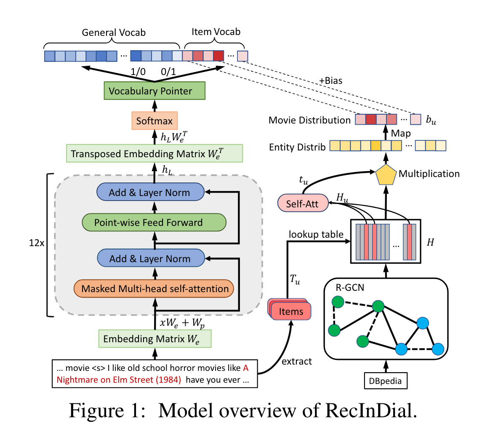
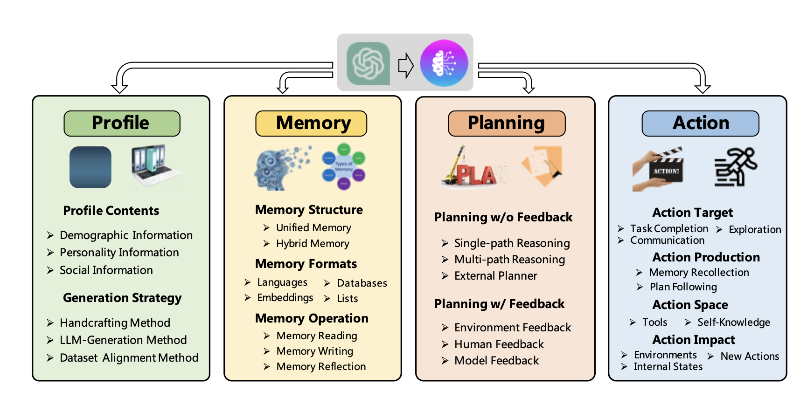
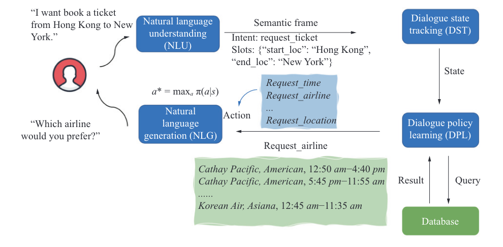
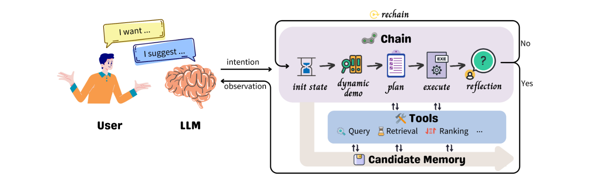

# How to merge external knowledge into LLMs
**Xunyi Jiang**
Southern University of Science and Technology
xunyijiang001@gmail.com

> This report explores the evolving landscape of Conversational Recommender Systems (CRS) in the context of Large Language Models (LLMs). It delves into the integration of knowledge graphs and advanced computational techniques to enhance the capabilities of CRS. The report categorizes current CRS methods into four main classes: knowledge-based, goal-driven, fine-tuning, and agent-based approaches, providing an in-depth analysis of each. Special attention is given to how these systems can optimize conversations and recommendations by harnessing the power of LLMs and external knowledge sources. The innovative use of agent-based methods and the challenges of fine-tuning LLMs for CRS are also discussed, highlighting the importance of efficient retrieval methods and the integration of external knowledge for improved system performance.

## Introduction
### Background Introduction
In the current surge of Large Language Models (LLMs), task-oriented dialogue (TOD) systems are an extremely important research topic, aiming to assist users in accomplishing tasks ranging from weather inquiries to schedule planning \citet{kwanSurveyRecentAdvances2023}. Conversational Recommender Systems (CRS) can be considered a branch of TOD. By utilizing methods such as Knowledge Graphs and Knowledge Fusion, combined with the generative capabilities and knowledge repository of LLMs, as well as external knowledge data, CRS can provide more rational recommendations. \citet{liConversationWorthThousand2023}

### Objective and Focus
The goal of Conversational Recommender Systems (CRS) is to recommend products or movies that match the interests of the seeker within the limited dialogue information. In current CRS research, there is a focus on more realistic and natural dialogue systems \citet{liuGraphGroundedGoalPlanning2022}, and the ultimate objective is to recommend items that align with the seeker's interests.

### Overview of Report Structure
This report primarily encompasses an overview and methodology of the classic models such as KECRS: Knowledge-Enriched Conversational Recommendation System, along with the methodology of Graph-Grounded Goal Planning in Conversational Recommendation. After discussing the knowledge retrieval methods, this report will reflect on different solutions to such a problem following the development of LLMs and agents.

I categorize the current CRS (Conversational Recommender System) methods into four main classes: knowledge-based, goal-driven, fine-tuning, and agent-based. In the first two sections, I explain the specific implementations of knowledge-based methods and goal-driven approaches through a detailed elaboration of KECRS, along with the methodology of Graph-Grounded Goal Planning in Conversational Recommendation. In the latter two parts, I explore how, in the context of the emergence of LLMs (Large Language Models) capabilities and the significantly increased knowledge intensity of models, our conversational recommender system can be further optimized through fine-tuning and agent-based methods.

## Knowledge based CRS
In many previous study, they focus on how to link the external database, such as DBpedia, with conversation generation module.In this report, I illustrate KECRS: Knowledge-Enriched Conversational Recommendation System \citet{zhangKECRSKnowledgeEnrichedConversational2021} to give a overview of KGs based conversational recommender system.

### Overview of KECRS
In the previous work, such as \citet{chenKnowledgeBasedRecommenderDialog2019}, they treat all items mentioned by the recommender as recommendations, leading to repeat recommendation. Besides, there are representation gap between knowledge graph embedding space and words embedding space and the distribution of entities also differing from dialogue to knowledge graph. For instance, each response by the recommender in REDIAL only contains 0.25 entities, which is from DBpedia \citet{zhangKECRSKnowledgeEnrichedConversational2021}. Moreover, KGs used in the former work \citet{sarkar-etal-2020-suggest} may contains irrelevant information and lose high-order neighbors, which limits their contributions to both the recommendation and response generation module.

### KECRS Model Structure
In the improvement of KBRD, the addition of BOE and infusion loss has achieved better results. Furthermore, in KECRS, the pipeline format is clearer, dividing the entire CRS into three distinct modules: Knowledge Graph Encoding Module, Recommendation Module, and Response Generative Module.

#### Knowledge graph encoding module
As for the knowledge graph encoding part, KECRS adopted R-GCN \citet{schlichtkrull2018modeling} to embed the structural and relational information in relation graph to learn entity representations. Denote relation graph, such as DBpedia, as $\mathcal{G}$. At the $(l+1)$-th layer, the representation of an entity $i$ in $\mathcal{G}$ is defined as,

$$
    \mathbf{h}_i^{(l+1)} = \sigma(\sum_{r\in R}\sum_{j \in N_i^r} \frac{1}{c_{i,r}}\mathbf{W}_r^{(l)}\mathbf{h}_j^{(l)} + \mathbf{W}_0^{(l)}\mathbf{h}_i^{(l)})
$$
where $\mathbf{h}\_i^{(l+1)} \in R^{d\_k}$  denotes the embedding of the entity $i$ at $l+1$-th layer, and $d_k$ denotes the dimension of the entity embedding at ($l$+1)-th layer. $N_i^r$ denotes the neighbor set of entity $i$ under relation $r \in R$. $\mathbf{W_r^{(l)}}$ is a learnable relation-specific transformation matrix for the embedding of neighboring nodes under relation $r$, and $\mathbf{W_0^{(l)}}$ is a learnable transformation matrix for the self-connection relation of the embedding of entity $i$. $c_{i,r}$ is the normalization constant which is $|N_i^r|$ here. After perform $L$ layers, KG encoding module obtains multiple representations for each entity $i$, namely $\{\mathbf{h}_i^{(0)},..., \mathbf{h}_i^{(L)}\}$. To intergrate different depth information, KECRS adoptes layer-aggregation mechanism to compute the representation $\mathbf{h}_i$ as follows,
\begin{equation}
    \mathbf{h}_i = \mathbf{W}_h([\mathbf{h}_i^{(0)}, \mathbf{h}_i^{(1)}, ...,\mathbf{h}_i^{(L)}]) + \mathbf{b}_h
\end{equation}

where $[,]$ denotes the concatenation operation, $\mathbf{W}_h \in \mathbf{R}^{d_f\times (L*d_k)}$ and $\mathbf{b_h} \in \mathbf{R}^{d_f} $ are learnable parameters. Finally, we can obtain the hidden representations of all entities in $\mathcal{G}$, which is denoted by $\mathbf{H}\in \mathbf{R}^{|V|\times d_f}$ .

#### Recommendation module
First extract entity list $E$ from the context, then represent user's profile as the concatenation of these entities' representations from $\mathbf{H}$, denoting as $\mathbf{H}_E \in \mathbf{R}^{|E|\times d_f}$. Adopting self-attention mechanism, the hidden representation $\mathbf{c}_E$ of $E$ as follows,
$$
    \mathbf{c}_E = \alpha \mathbf{H}_E
$$
where $\alpha = \text{softmax}(\mathbf{W}_k \tanh(\mathbf{W}_q)\mathbf{H}_E^T )$, and $\mathbf{W}_q \in \mathbf{R}^{d_q \times d_f}$ and $\mathbf{W}_k \in \mathbf{R}^{d_q}$ are learnable parameters. Finally, the recommendation probability can be computed as,
$$
    P_{\text{rec}} = \text{softmax}({\mathbf{c_EH_I}^T})
$$
where $\mathbf{H}_I$ is the matrix selecting from $\mathbf{H}$ that only contains the hidden representation of items.

#### Response generative module
This module can be divided into 4 parts.

- **Transformer encoder**: Given the context utterance $X$, after concatenation all sentences to obtain $X_{\text{all}}$, KECRS uses embedding layers $E_m$ to convert each word $t_i$ in $X_{\text{all}}$ into a vector $\mathbf{t_i}\in \mathbf{R}^{d_t}$, after $n_e$ Transformer encoder layers, context representations can be written as,
$$
        T_{n_e} = \{t_0^{n_e}, ..., t_{\hat{n}}^{n_e}\}
$$ where $\hat{n}$ is the number of transformer layers.
    
-  **Decoder**: In the decoder, at time $j$ after aligning the dimension of hidden representation and user's hidden representation $\mathbf{c}_E$, $P_\text{res}$ can be calculated as following,
$$
        P_\text{res} = \text{softmax}(\phi([\mathbf{s}_j, \mathbf{c}_E])\mathbf{W}_{E_m}^T + \mathbf{b}_{\text{res}})
$$

- **Entity Selection**: Based on the Bag-of-words \citet{ma2018bag}, KECRS introduces Bag-of-Entity (BOE) loss. The intuition behind BOE loss is that BOE loss can provide an additional supervision signal, and thus guide the model to generate knowledge-enriched responses not only from utterances in training data but also from the neighboring entities of recommended items in KG \citet{zhangKECRSKnowledgeEnrichedConversational2021}.

- **Embedding Alignment**: Since there exists a gap between the representation space of words and in the entity representation space.  By minimizing the infusion loss $L_{\text{infuse}}$, this gap can be weakened.

### Conclusion and Future Work
This model not only analysis the representation gap between the entity embedding space and word embedding space, but construct a more clean KG in order to generate more relevent items aligning with the user's interests. But it is not considering other knowledge of LLMs, since all the parameters are trained from stretch. The next model will combine the short-term and long-term goals into the pipeline in order to boost the performance of both naturally and chitchat conversation. Besides, adding the social strategies and behaviors \citet{hayatiINSPIREDSociableRecommendation2020} may also be a choice to lead a more natural conversation.

## Goal driven methodology
Not only combine external knowledge into the language generation, some research focus on the goal planning and more natural conversation. Graph-Grounded Goal Planning in Conversational Recommendation \citet{liuGraphGroundedGoalPlanning2022} define different long-term and short-term goals, such as "QA, recommendation, greeting, chitchat" to achieve a more diverse and natural dialogue.

### Overview of Multi-Goal driven Conversation Generation
The concept of Multi-Goal driven Conversation Generation (MGCG) is centered on dynamically managing multiple conversation goals. This approach allows for more flexible and engaging dialogues, catering to varied user needs and contexts. MGCG aims to simulate more natural and human-like interactions in conversational systems by juggling between different conversational objectives, such as providing information, maintaining engagement, and offering recommendations.

### Framework of MGCG
First, in this paper, authors introduce the definition of \textit{Dialog goal}, which is a triplet, denoted as $\mathbf{g} = <g^p, g^o, g^r>$, where $g^p \in \mathrm{P}$ denotes goal types (e.g., QA, chitchat and recommendation), $g^o \in \mathrm{O}$ represents goal topic and $g^r \in \mathbf{R}$ is a set of topic facets about $g^o$. \citet{liuGraphGroundedGoalPlanning2022}

#### Graph-grounded Goal Planning
This section will contains two sub-tasks, \textit{current goal completion estimation} and \textit{next goal prediction}. $\mathcal{G'}$ means the goal history $\{g_i\}_{i = 1}^t$, $X$ represents the set of dialogue context, $\mathcal{K}$ means the knowledge graph.

- **current goal completion estimation**: Before predict the next goal, MGMC first predict whether this goal is completed.
$$
    P_{\text{GC}}(l = 1|X, \mathbf{g}_t)
$$
- **next goal prediction**: If $P_{\text{GC}} < 0.5$, then MGCG will predict the next goal $g_{t+1}$ is
$$
    \text{argmax}_{g_{t+1}}P_{\text{GP}}(g_{t+1}|X, \mathcal{G}', \mathcal{P}^k, \mathcal{K})
$$

This is the baseline of goal planning part, authors retain the transition structure of the goals, which contains more information and has better performance for the goal planning. This module contains inputs of goal planning, hierarchical graph construction and learning, goal sequence dependency learning and prediction. \citet{liuGraphGroundedGoalPlanning2022} The input is the goal planning sequence and utterance, then the goals can be split into different sub-graphs by the goal type, goal topic and topic attribute graph. After embedding these sub-graphs into vector space through GCN techniques, MGMC can use these representations to predict the next goal.

#### Responding module
Through the goal-guided response retrieval model and goal-guided response generation model, MGMC can fully exploit the hierarchical graph to enhance the accuracy of predicting goals.

### Conclusion and Discussion
This article introduces the concept of goal planning, which is very similar to inference using a tree structure. However, due to the large scale of the modules in this paper, it is difficult to determine which module plays the most crucial role. Nevertheless, constructing a goal graph for further prediction is a reasonable approach. This suggests that if we implement a conversational recommender system using an agent-based method, we can connect and learn the goals of each stage of the agent through a graph. This will enable the agent to achieve our ultimate objective. Inspired by CLIP \citet{radford2021learning}, different representation spaces can be aligned with linear transformation. C2-CRS \citet{zhouC2CRSCoarsetoFineContrastive2023} uses coarse-to-fine contrastive learning to boost the performance of conversational recommender system. Besides, in the area of self-supervised learning, \citet{chen2020simple} shows that only one linear layer can align the representation space with contrastive loss.

## Fine-tuning LLMs for CRS
### PEFT Overview
In this section, I want to briefy introduce my thoughts about the PEFT methods recently to refine this.
Besides using the full fine-tuning approach at \textbf{INSPIRED} \citet{hayatiINSPIREDSociableRecommendation2020}, which involves global fine-tuning from a dataset \textbf{INSPIRED} rich in dialogue, there are many other methods to achieve more efficient and more interpretable fine-tuning. One such method is parameter-efficient fine-tuning (PEFT), such as Adapter-based fine-tuning \citet{houlsby2019parameter}, LoRA \citet{huLoRALowRankAdaptation2021}, Prefix-tuning \citet{li2021prefix}, Prompt-tuning \citet{wangRecInDialUnifiedFramework2022}, P-tuning \citet{liu2023gpt}, and BitFit \citet{zaken2022bitfit}. 

### RecInDial Methodology
In RecInDial \citet{wangRecInDialUnifiedFramework2022}, they have proposed a unified framework that leverages a knowledge graph to establish an R-GCN (Relational Graph Convolutional Network). This is further enhanced by a self-attention mechanism to obtain movie distribution. The most critical aspect of this framework is the construction of a vocabulary pointer. This pointer introduces external knowledge by predicting both the movie vocabulary and the general vocabulary. Additionally, fine-tuning the language model is part of the process, where PEFT (Parameter-Efficient Fine-Tuning) methods like adapters or LoRA (Low-Rank Adaptation) are used to minimize computational load.

## Agent Base Methods for CRS
### Overview of Agent system
Currently, autonomous agents can interact with humans, tools, environments, or other agents. In 'LLM with tools,' we can use a code interpreter to parse code, and the Wolfram tool to solve more complex mathematical problems. There has been significant research to enable LLMs to autonomously use tools, such as ToolFormer \cite{schick2023toolformer} and the pre-trained ToolLLaMA \cite{qin2023toolllm}. In autonomous agents, we can divide them into four main parts based on the final goal, like a recommendation system: Profile, Memory, Planning, Action \cite{wang2023survey}. Current methods like ReAct \cite{yao2023react}, Self-Refine \cite{madaan2023selfrefine}, and Reflexion \cite{shinn2023reflexion} are examples of this.

In the context of autonomous agents, a unified framework for the architecture design of LLM-based autonomous agents has been proposed \cite{wang2023survey}.
<!-- \begin{figure}[ht]
\centering
\includegraphics[width=0.5\textwidth]{images/image-20231224152952795.png}
\caption{A unified framework for the architecture design of LLM-based autonomous agent. \cite{wang2023survey}}
\end{figure} -->

Besides the top-level agent-based approach, which achieves different objectives through API calls, a recent survey \cite{kwanSurveyRecentAdvances2023} divides Task-oriented Dialogue Policy Learning into four main steps: Natural Language Understanding (NLU), Dialogue State Tracking (DST), Dialogue Policy Learning (DPL), and Natural Language Generation (NLG). I believe that CRS, as a branch of task-oriented dialogue, can also be encompassed by this framework. For example, in graph-grounded goal planning \citet{liuGraphGroundedGoalPlanning2022}, predicting whether the current task is finished and planning short-term goals can be equivalent to dialogue state tracking and dialogue policy learning.

### An Angent Example: InteRecAgent Framework

In CRS, here are some new methods embedded with agent merged recent months. For instance, InteRecAgent \citet{huang2023recommender} uses LLMs as the 'brain' and recommenders as tools to propose a recommendation plan. It employs a rechain method to obtain more effective recommendation plans. For structured databases, tools include SQL queries, retrieval tools, and ranker tools. InteRecAgent proposes an efficient workflow for task execution, incorporating components like a memory bus, dynamic demonstration-augmented task planning, and reflection.

## Conclusion and Future Work
The core of this report can be described as two questions:

- If we still need retrieval based methods to complete this task, how to retrieve more efficiently?
- Whether we need the external knowledge such as knowledge graph to retrieve information?

Regarding the first issue, while the four methods previously mentioned are effective for retrieval, such as knowledge graph (KG) based methods, the emergence of Large Language Models (LLMs) presents unique challenges. Firstly, despite their vast knowledge base, LLMs lack fine-grained knowledge. Secondly, in domains where knowledge is highly specialized or private, LLMs might struggle to comprehend the specifics. Furthermore, information within LLMs can become outdated, and the process of fine-tuning them is often costly. Considering these factors, approaches that focus on learning from small samples and agent-based strategies seem more practical and appropriate. \citet{huang2023recommender}

As for the second issue, research, including studies like RecInDial \citet{wangRecInDialUnifiedFramework2022}, has demonstrated the significant benefits of incorporating a knowledge graph into systems. This integration notably enhances metrics such as recall, item ratio, BLEU, and Rouge-L scores. These improvements underscore the importance and necessity of integrating external knowledge into these systems to achieve better performance and more accurate results.

Developing methods to infuse fine-grained, domain-specific knowledge into LLMs will be crucial, especially in private or highly specialized fields. Further exploration into small-sample learning and agent-based strategies is recommended to enhance the efficiency and applicability of CRS in diverse contexts. Additionally, the integration of knowledge graphs should be further explored, not only to improve performance metrics but also to provide more contextually relevant and personalized recommendations. Experimentation with advanced computational techniques, such as parameter-efficient fine-tuning methods, could yield more resource-efficient ways to adapt LLMs to specific CRS tasks. Lastly, future work could benefit from a deeper investigation into the synergy between conversational agents and human-like interaction patterns, aiming to create more intuitive and user-friendly conversational interfaces. This comprehensive approach will propel the development of more sophisticated, efficient, and user-centric CRS.

